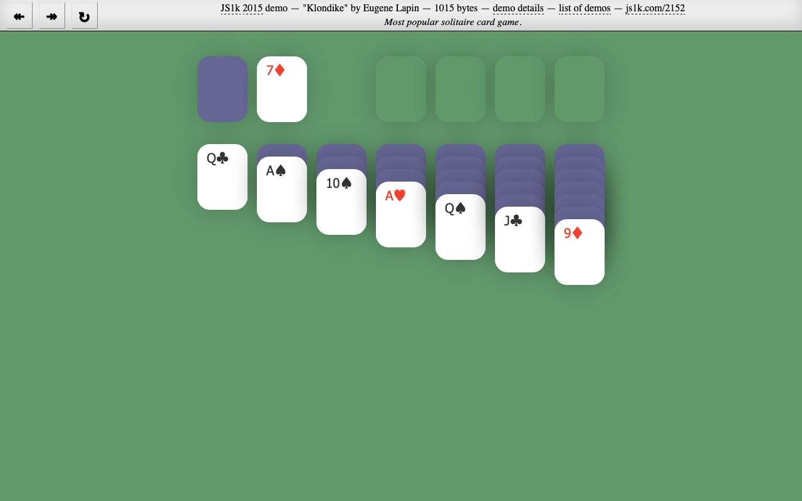

## Klondike - 1K JavaScript demo

This version of a popular card game was created for [JS1k](http://js1k.com/) code golfing
competition. It has rank #6 in the [compo](http://js1k.com/2015-hypetrain/).

The demo entry can be seen on the JS1k [website](http://js1k.com/2152) or built from source code.

Build dependencies:
* bash
* Java
* Node.js

### Quick start
```
$ git clone git@github.com:kolduras/klondike-2015.git
$ cd klondike-2015
$ npm install && npm start
```